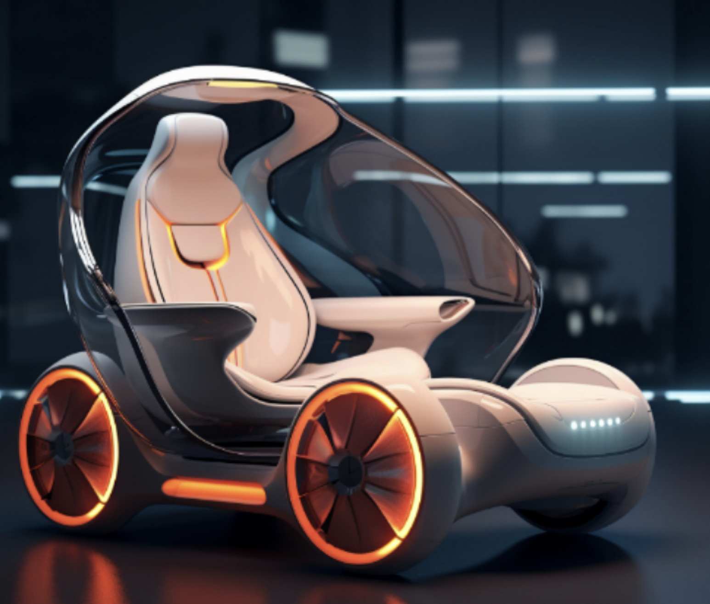
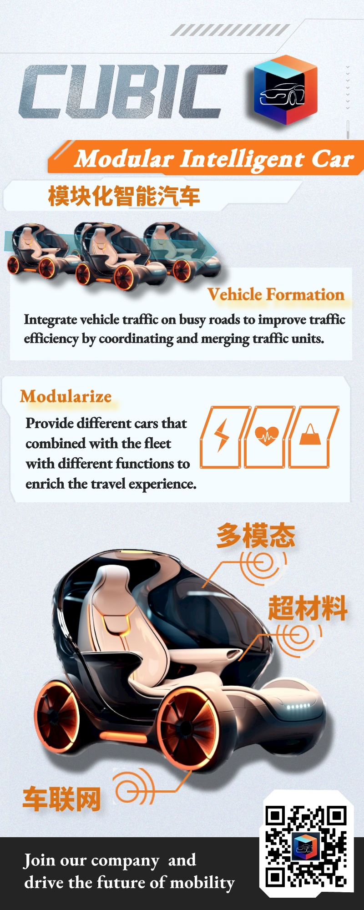
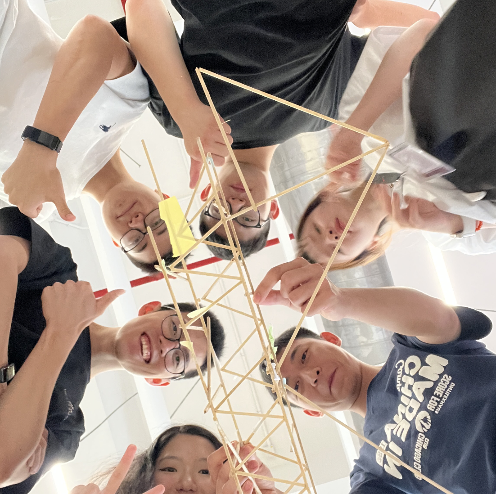
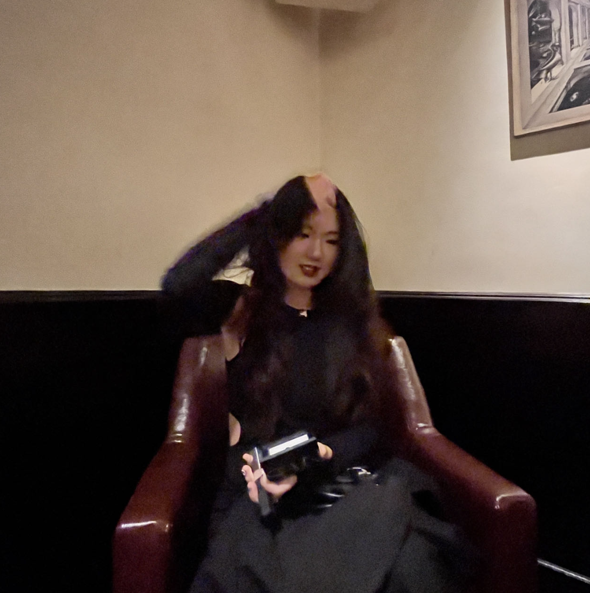
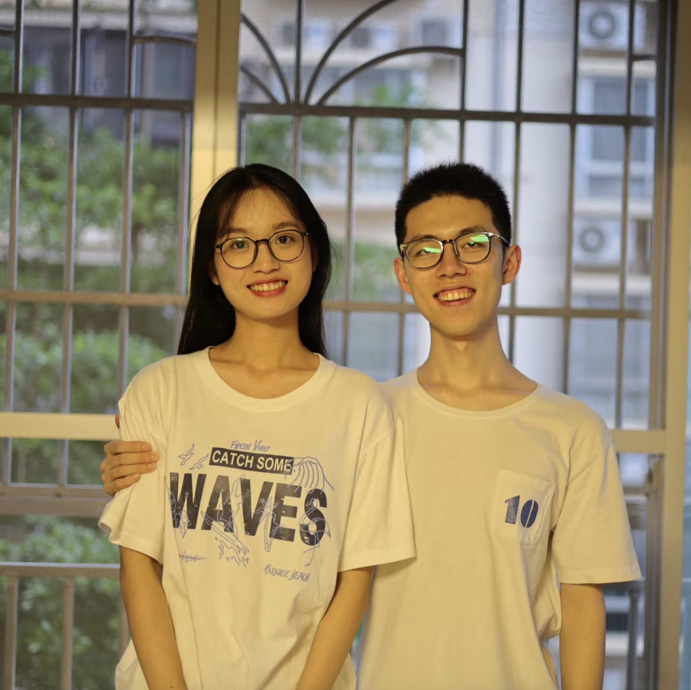
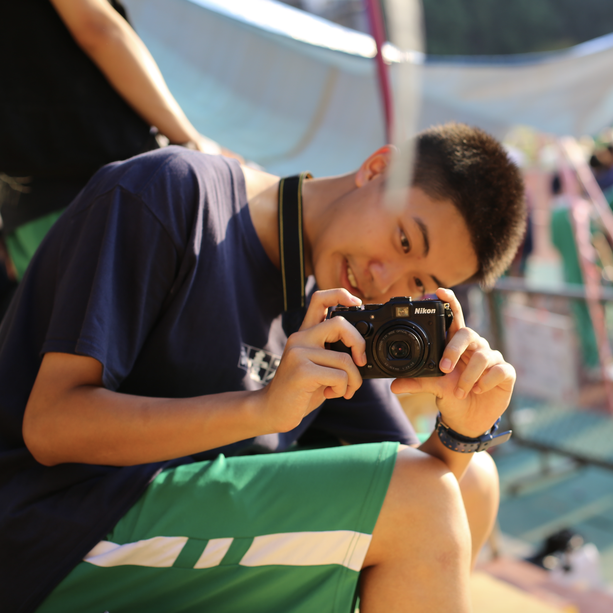
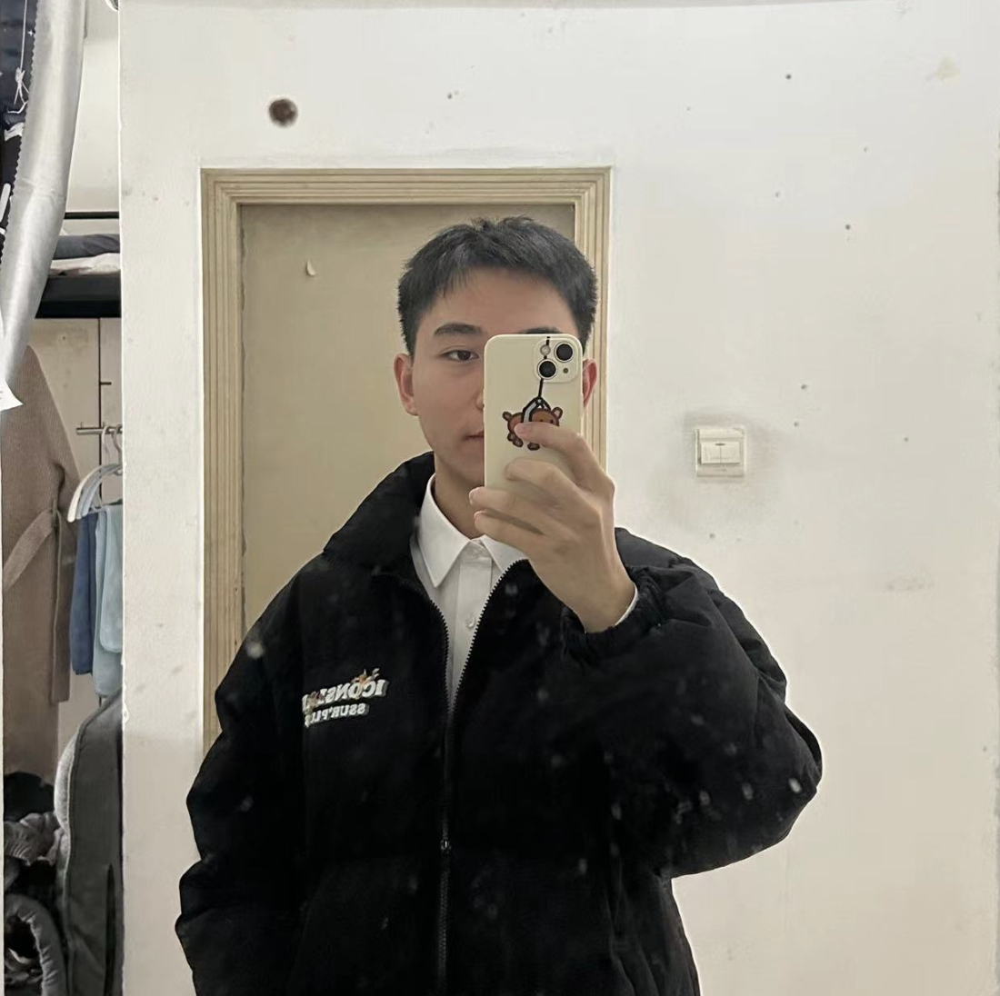
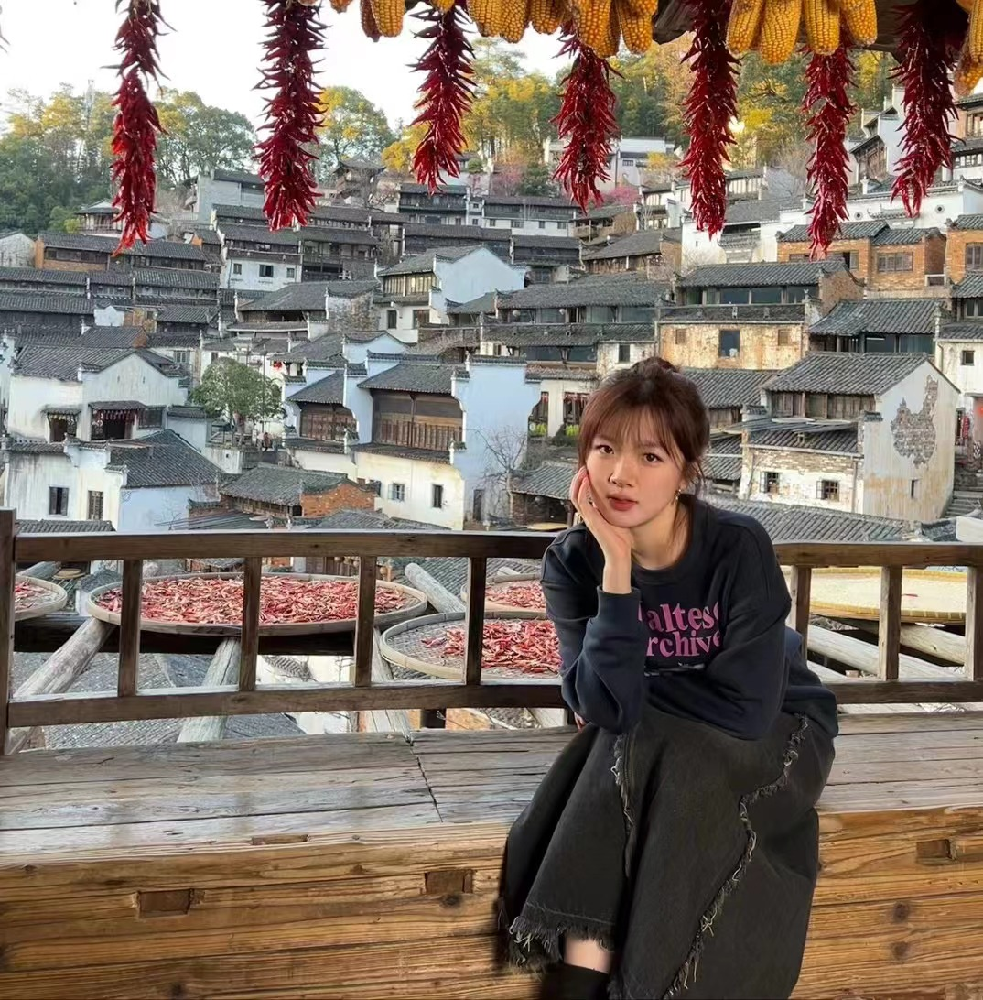

# Cubic

**Here is Modular Intelligent Car**

**BEV**

**Vehicle Foemation**

**Traffic Flow Analysis**

## Company Introduction

**Cubic is a smart connected vehicle manufacturing company based on autonomous driving and vehicle-to-everything (V2X) technology. Our mission is to address the urban commuting challenges of the future in the field of intelligent transportation. We aspire to become a leading force in the autonomous driving industry, and we embrace the values of social responsibility,  people-oriented approach, and sustainable development. Inspired by modular cubic elements, we have named our company "Cubic Modular Intelligent Vehicles Ltd.," combining intelligent connected vehicles as our core focus.**

---

## Company Culture

**Our company's culture is centered on innovation, responsibility, and people-centricity. As a smart connected vehicle manufacturer specializing in autonomous driving and vehicle-to-everything (V2X) technology, we aim to address future challenges in intelligent transportation and urban commuting.**

---

 

---

## Our Team

### 邝玥琳Kuang Yuelin 

Position: CEO
Education:South China University of Technology
Major: Resources and Environmental Science
E-mail：15889902965@163.com
Job Description:
• Make decisions on major business matters
• Responsible for daily business activities
• Appointment and removal of senior management
• Reasonable adjustment of the company's business scope and direction
What I do in the project:
• Participate in institutional conceptual design and program proposal
• Carbon fiber reinforced composite material design
• Metamaterial mechanism design and
• SolidWorks Modeling and 3D printing
• Enterprise architecture construction
• Project cycle research and evaluation
Know More about me with Numbers：
•1 ENGO：Greenway Fun Run绿道乐跑
•2 Publications：《中国造纸》《Composites Science and Technology》
•2 College Students'innovation and Entrepreneurship Competition(National level)
•2 “Climbing” Innovation Fund Project (Provincial & School level)
•3 “Internet+” Innovation and Entrepreneurship Competition(Silver Award)
•5 Intership (TV station, Environment Bureau, Bank, Securities, Environmental investment group)

### Name: Chen Liangliang
Position: CFO (Chief Financial Officer)
Major: Public Finance
Work content: Enterprise strategic design, financing plan, and government cooperation.
What to do in the project: The project aims to clarify the corporate values and social values that need to be realized. It also involves designing the cooperation mode between the company and the government, as well as the equity structure of the company group.

### Name: Zixuan Chen

Position: CTO-web
Major: Computer Science and TechnologyJob Description: Responsible for leading the research and development direction of 6G+ vehicle-to-vehicle communication technology; taking charge of the development of both the vehicle's supporting client and server applications; driving the implementation of big data technology in vehicle platooning and vehicle-to-vehicle communication.

Tasks in the Project: Participating in the preparation of technical documentation, including feasibility analysis and technical implementation of 6G, edge computing, big data, and their application in vehicle platooning and vehicle-to-vehicle communication; based on research findings, designing project timelines and creating Gantt charts; designing and developing the user interface (UI) demo for vehicle central control panel and mobile client; contributing to the technical part of the presentation materials for the project's roadshow.

### Xiao Zhaorun
School: Tongji University
Major: Vehicle Engineering
Job description: Responsible for the construction of the team's vehicle system and coordinate the operation of the entire team.
Areas of expertise: 3Dmodeling, mechanical simulation, autonomous driving

### CIO·李靖雯  LI JINGWEN    

Education：Anhui University                                                                   Major：Applied Statistics                                                                              E-mail：ljw15512135286@163.comself-evaluation： skilled in using R, Matlab, Excel, Spss, visio and other software for data analysis. Ability to write bilingual papers and read English literature independently.  good at summary thinking, time management planning, teamwork, analysis and comprehensive decision-making, and strong drive.

### Name: Xu Haoxuan 

Education：Shandong University         Major: Telecommunication Engineering

 Job Description: Responsible for building cutting-edge autonomous driving algorithms, developing V2X vehicle-to-everything framework and applications.

Contributions to the project: Implemented autonomous driving algorithms with a focus on computer vision, developed vehicle-to-everything applications, designed car convoy tracking algorithms, and contributed to web development.

 

---

 
