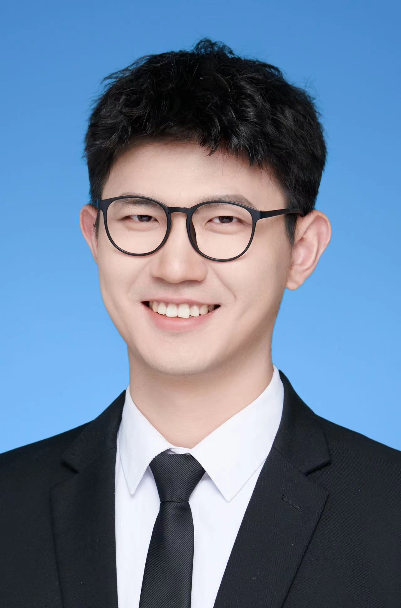

# About Me

Here is **Haoxuan Xu ( [徐浩轩] [resume of Haoxuan Xu.pdf](file/resume of Haoxuan Xu.pdf) )**.

I am a junior majoring in **Communcation Engineer** at Shandong University .  Here is [my Resume](https://caihanlin.com/file/Resume-HanlinCAI.pdf).

 

## Academic Background

**[Highlight] I am looking for PhD/Mphill to start in 2024 Fall. **

- **Sep 2020 - June 2024:** Shandong University (BEng)

- **Sep 2021 - June 2024:** Chongxin College (EECS base class)

  

 

---

## Research Interests

- Computer vision
- Autonomous driving
- AI for social good

My research interests focus on practical problems in artifical intelligence and the potential applications of Deep Learning in various fields.I believe that advanced technologies like DL can have a positive impact on society.What I have researched includes computer vision,especially in object detection, and Natural Language Processing for social sciences.I am committed to contributing to meaningful causesthat bring benefits to society through the development of practical DL and ML solutions.

 

---

## News and Updates

- **May 2023：**Happy to be awarded the XiamenAir Scholarship.
- **May 2023：**Happy to win the Finalist Award in MCM 2023.
- **Feb 2023：**[**FZU-Flying-Book 福州大学飞跃手册**](https://fzu-fly.online/) has been published!
- **Jan 2023：**One paper accepted to ICAROB 2023, see you in Japan!
- **Dec 2022：**Research assistant at IACTIP Lab, advised by [Prof. Zhezhuang Xu](https://dqxy.fzu.edu.cn/en/info/1009/1072.htm).
- **Sep 2022：**Happy to be nominated for the China National Scholarship.
- **Jun 2022：**Summer Research Intern at University of Cambridge, advised by [Prof. Pietro Liò](https://www.cl.cam.ac.uk/~pl219/ ).

 
