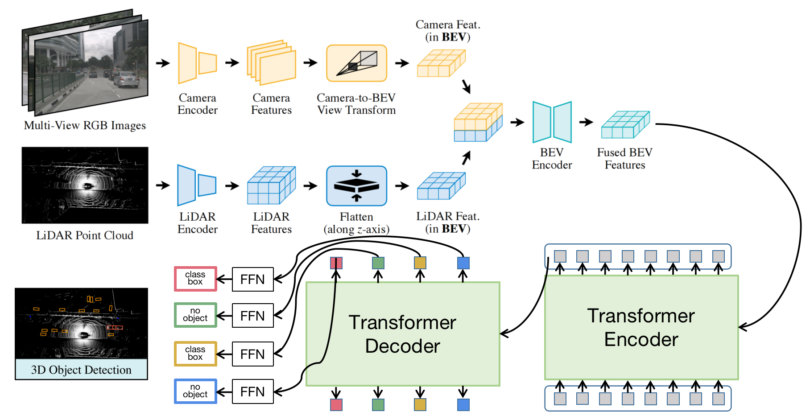
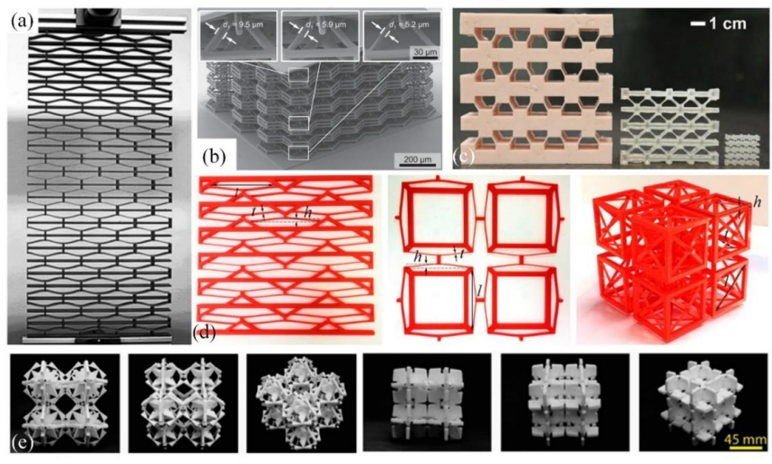
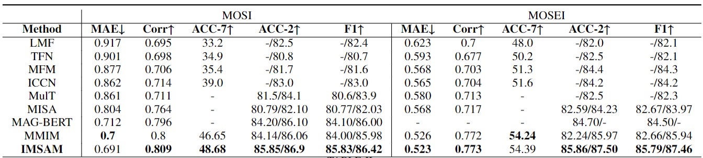
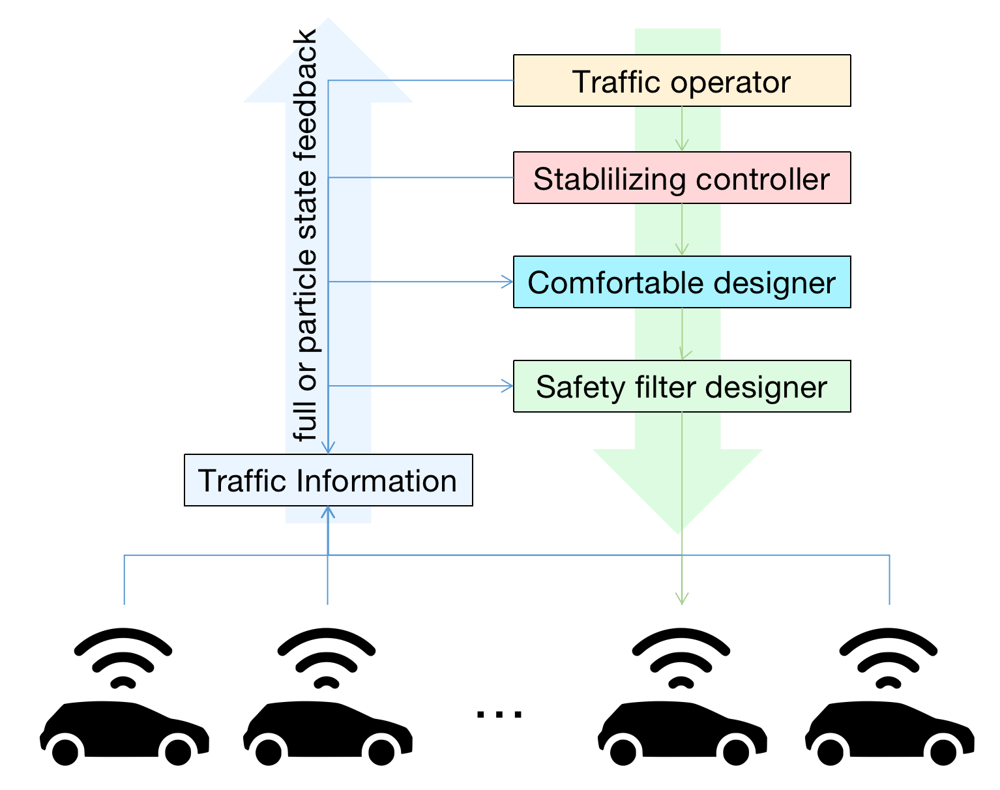
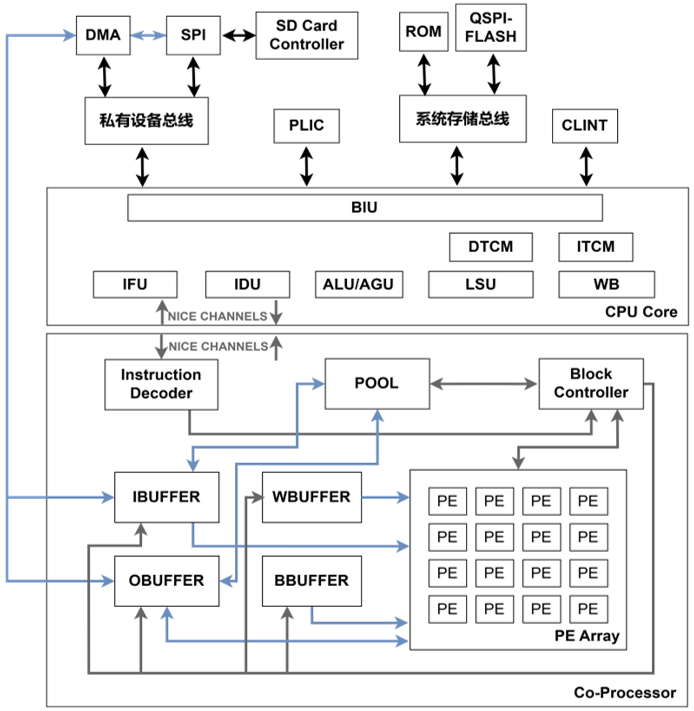

# Muti-sensor 3D Object Detectation

 

---

# Cubic materials

 

---

# Application of IoV

 

---

# Hardware Acceleration

 

---
# [Technical Document](publications/images/Smarthome__中文版0709.pdf)

 

---

